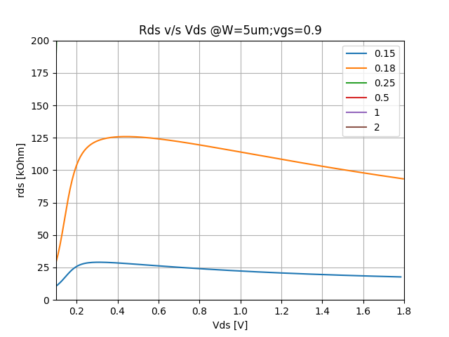
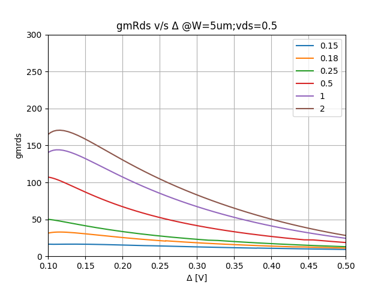
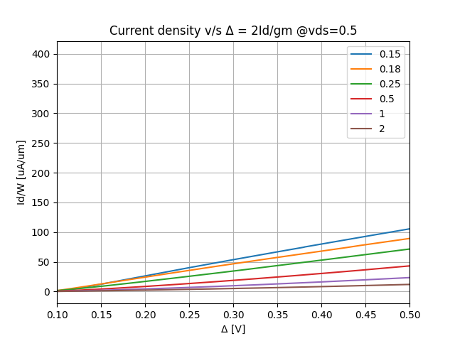
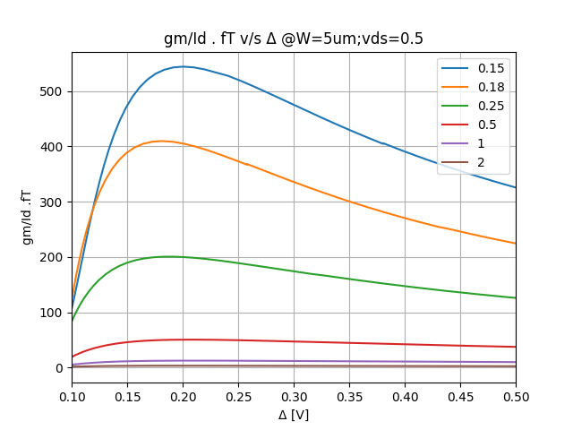
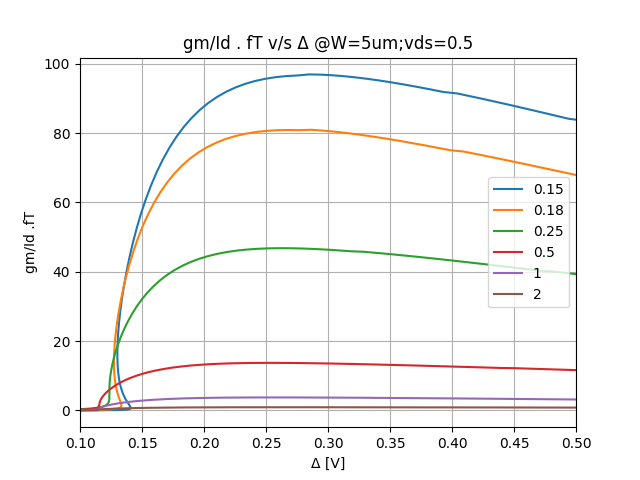
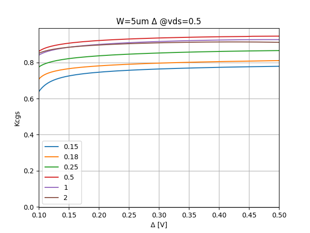

# sky130_fet_modeling
Repository for regular vt nmos and pmos model for the sky130 technology. 
Delta is defined as 2Id/gm in place of Vov. 
Plots are generated for simulated data

| NMOS | PMOS |
|------|------|
|||
|||
|||
|||
|||
|||
|||
